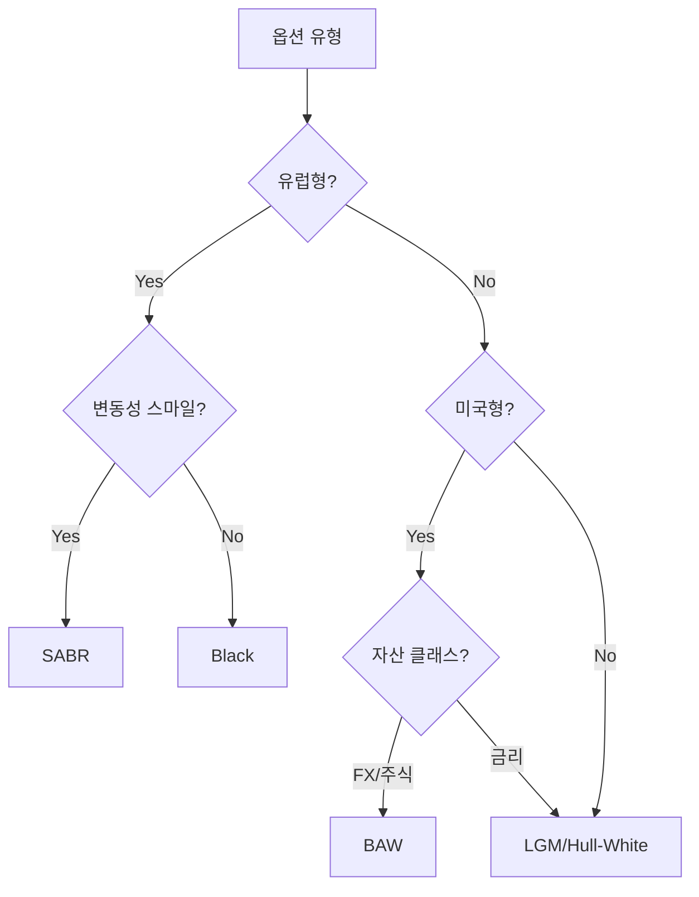

# 가격결정 모델 (Pricing Models)

ORE는 다양한 파생상품 유형에 대해 적절한 가격결정 모델을 제공합니다. 이 문서는 ORE에서 지원하는 주요 가격결정 모델과 그 특징을 설명합니다.

## 모델 개요

ORE는 상품 유형과 특성에 따라 다음 모델들을 사용합니다:

| 모델 | 주요 용도 | 자산 클래스 |
|------|----------|-------------|
| **Black** | 유럽형 옵션, 캡/플로어, 스왑션 | 금리, FX, 주식, 상품 |
| **Shifted Black** | 로그노멀 가정이 맞지 않는 경우 | 금리, FX |
| **SABR** | 변동성 스마일 모델링 | 금리, FX, 인플레이션 |
| **LGM (Linear Gauss Markov)** | 베르무단/미국형 스왑션, 콜러블 본드 | 금리 |
| **Hull-White** | 베르무단/미국형 옵션 | 금리 |
| **Barone-Adesi Whaley** | 미국형 옵션 근사 | FX, 주식 |
| **Bachelier** | 정규분포 가정의 옵션 | 금리 (마이너스 금리) |
| **LTSR (Linear Terminal Swap Rate)** | 스왑션 가격결정 | 금리 |
| **Brigo-Mercurio** | CMS 스프레드 옵션 | 금리 |

## 상세 모델 설명

### Black 모델 (p.297)

**가정**: 로그노멀 분포, 일정한 변동성

**주요 특징**:
- 유럽형 옵션의 표준 모델
- 캡/플로어, 스왑션, FX 옵션, 주식 옵션에 적용
- 변동성 스마일을 직접 모델링하지 않음 (단일 변동성 사용)

**적용 상품**:
- 유럽형 스왑션
- 캡/플로어
- 유럽형 FX 옵션
- 유럽형 주식 옵션

### SABR 모델 (Stochastic Alpha Beta Rho)

**가정**: 확률적 변동성, 로그노멀 분포

**주요 파라미터**:
- **Alpha**: ATM 변동성
- **Beta**: 탄성 계수 (0~1, 0.5는 CEV)
- **Rho**: 변동성과 기초자산 간 상관관계
- **Nu**: 변동성의 변동성

**장점**:
- 변동성 스마일 효과 모델링
- 각 만기별/행사가별 변동성 일관성 유지
- 시장 변동성 표면 피팅에 적합

**적용 상품**:
- 캡/플로어 변동성 표면
- 스왑션 변동성 표면
- FX 변동성 표면
- 인플레이션 캡/플로어

### LGM 모델 (Linear Gauss Markov)

**가정**: 선형 가우시안 마르코프 프로세스

**주요 특징**:
- 1요소 선형 모델
- 해석적 솔루션 가능
- 트리 구조를 통한 미국형/베르무단 옵션 평가

**주요 파라미터**:
- **Mean Reversion**: 평균 회귀 속도
- **Volatility**: 변동성
- **Calibration**: 스왑션 시장 가격으로 보정

**적용 상품**:
- 베르무단 스왑션
- 미국형 스왑션
- 콜러블 본드
- 콜러블 스왑

### Hull-White 모델

**가정**: 확장된 Vasicek 모델 (시간 의존적 파라미터)

**주요 특징**:
- 평균 회귀 확률과정
- 시간 의존적 변동성 및 평균 회귀
- 트리 또는 유한차분법으로 수치해

**적용 상품**:
- 베르무단 옵션
- 미국형 옵션
- 콜러블 본드

### Barone-Adesi Whaley (BAW) 근사법

**가정**: 로그노멀 분포

**주요 특징**:
- 미국형 옵션의 해석적 근사
- 빠른 계산 속도
- 정확도가 높은 근사치

**적용 상품**:
- 미국형 FX 옵션
- 미국형 주식 옵션

### Bachelier 모델

**가정**: 정규분포 (이자율이 음수 가능)

**주요 특징**:
- 마이너스 금리 환경에서 적합
- 정규분포 가정

**적용 상품**:
- 마이너스 금리 환경의 옵션
- 금리 옵션 (EU 지역 등)

### LTSR 모델 (Linear Terminal Swap Rate)

**가정**: 만기 스왑 레이트의 선형 모델

**주요 특징**:
- 스왑션 가격결정에 특화
- Brigo-Mercurio와 유사하지만 단순화된 구조

**적용 상품**:
- 유럽형 스왑션

### Brigo-Mercurio 모델 (Bivariate Swap Rate)

**가정**: 두 스왑 레이트의 이변량 모델

**주요 특징**:
- CMS 스프레드 옵션 가격결정
- 두 지수 간의 상관관계 모델링

**적용 상품**:
- CMS 스프레드 옵션

## 수치 방법

모델 구현을 위한 수치적 방법:

| 방법 | 설명 | 주요 용도 |
|------|------|-----------|
| **해석적 공식** | 폐쇄형 해 | 유럽형 옵션, 캡/플로어 |
| **트리 (Tree)** | 이항/삼항 트리 | 미국형/베르무단 옵션 |
| **유한차분법 (Finite Difference)** | PDE 수치해 | 복잡한 옵션, 바리어 |
| **몬테카를로** | 시뮬레이션 | 복잡한 파생상품, 패스의존형 |

## 모델 선택 가이드



## 설정 방법

가격결정 엔진은 `pricingengine.xml`에서 구성합니다:

```xml
<Product productType="Swaption">
  <Model>LGM</Model>
  <ModelParameters>
    <Lambda>0.01</Lambda>
    <Volatility>0.01</Volatility>
  </ModelParameters>
  <EngineParameters>
    <TimeSteps>100</TimeSteps>
    <Grid>301</Grid>
  </EngineParameters>
</Product>
```

## 관련 개념

- [[concepts/curve-building]] — 모델 입력 데이터인 곡선 구축
- [[summaries/products]] — 상품별 모델 적용 방법
- [[concepts/monte-carlo-simulation]] — 몬테카를로 방법론
- [[summaries/userguide]] — 가격결정 엔진 설정

## 보정 (Calibration)

모델 파라미터는 시장 데이터로부터 보정됩니다:

1. **변동성 보정**: 캡/플로어, 스왑션 가격 → SABR 파라미터
2. **LGM 보정**: 스왑션 가격 → 평균 회귀 및 변동성
3. **상관관계 보정**: 다중 자산 상품 → 상관관계 행렬

## 성능 고려사항

- **해석적 모델**: 가장 빠름 (Black, BAW)
- **트리/유한차분**: 중간 속도 (LGM, Hull-White)
- **몬테카를로**: 가장 느리지만 유연함
